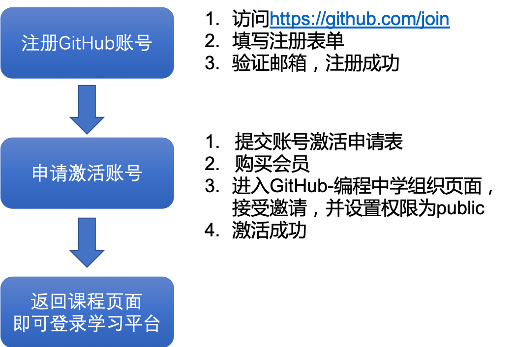

+++
title = "申请正式账号"
weight = 30
+++

申请正式账号你需要先拥有一个GitHub账号，然后再申请激活你的GitHub账号。

```
GitHub是全世界最大的软件程序开发者社区，截至2019年8月，已拥有超过4000万开发者。我们将帮助你注册一个GitHub账号，加入充满未知和挑战的编程世界。
```

#### 整体流程



### 分步操作：

1. [注册GitHub账号]()
2. [申请激活账号]()
3. [返回课程页面，登录学习平台]()
