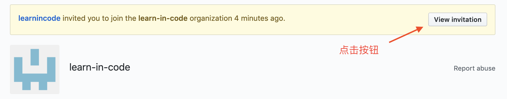
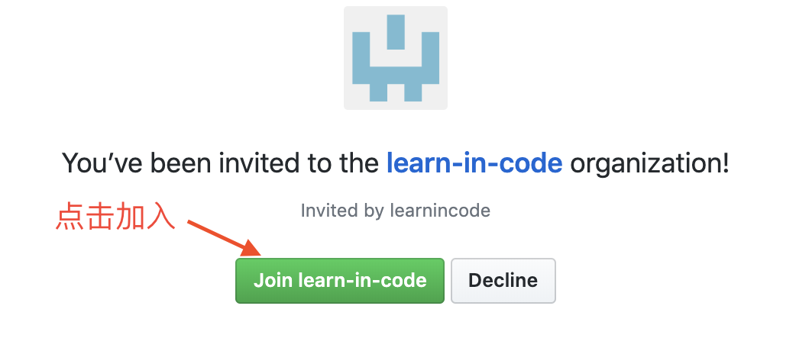
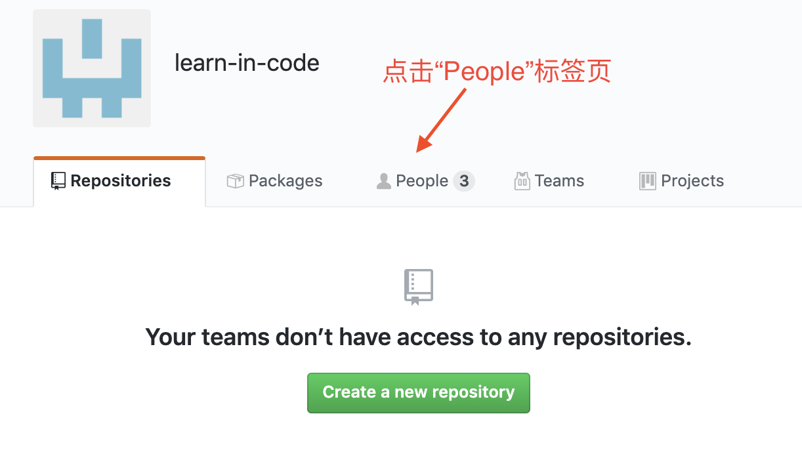
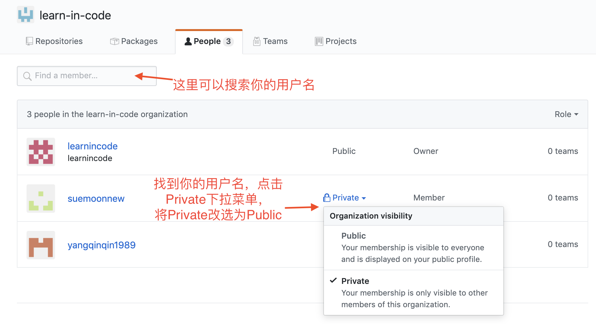

+++
title = "激活你的账号"
weight = 2
+++

# 申请激活你的账号

## 登录淘宝链接

## 购买成功后，进入https://github.com/learn-in-code

#### 1. 查看加入“编程中学”组织的邀请

#### 2. 点击加入

#### 3. 进入“People”标签页

#### 4. 找到自己的用户名，将可见性由Private改为Public。

#### 5. 返回“选择课程”页面，点击任一课程的“正式学习”链接，即可登录平台学习。
