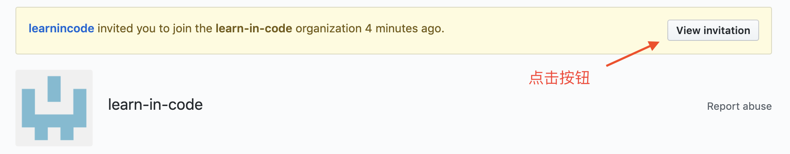

+++
title = "激活你的账号"
weight = 2
+++

## 购买会员

请使用手机识别下方二维码，或[直接访问购买链接](https://weidian.com/item.html?itemID=3019649856)。

### 会员权益
1. 会员有效期内，所有课程都可以学习。
2. 配置专属于你的一台云端服务器，供你运行程序。
3. 程序的修改记录可以永久保存。
4. 会员有效期三个月，自你成功购买之日起计算。

### 购买时请注意
1. 下单时，请务必填上学员准确的GitHub用户名和手机号码，方便我们为你开通会员。
2. 交易依托微店平台作为交易资金担保方，您可以放心交易。

## 购买成功后

客服会在10分钟内，向您的GitHub账号发送加入“编程中学”组织的邀请，待收到客服通知后，请按如下步骤接受邀请。

#### 1. 进入链接： https://github.com/learn-in-code

点击“View invitation”, 查看“编程中学”的邀请

#### 2. 点击加入

#### 3. 进入“People”标签页

#### 4. 找到自己的用户名，将可见性由Private改为Public。

#### 5. 返回[开始学习](/docs/courses/)页面，点击任一课程的“正式学习”链接，即可[登录平台学习](/docs/apply-account/back-login/)。

