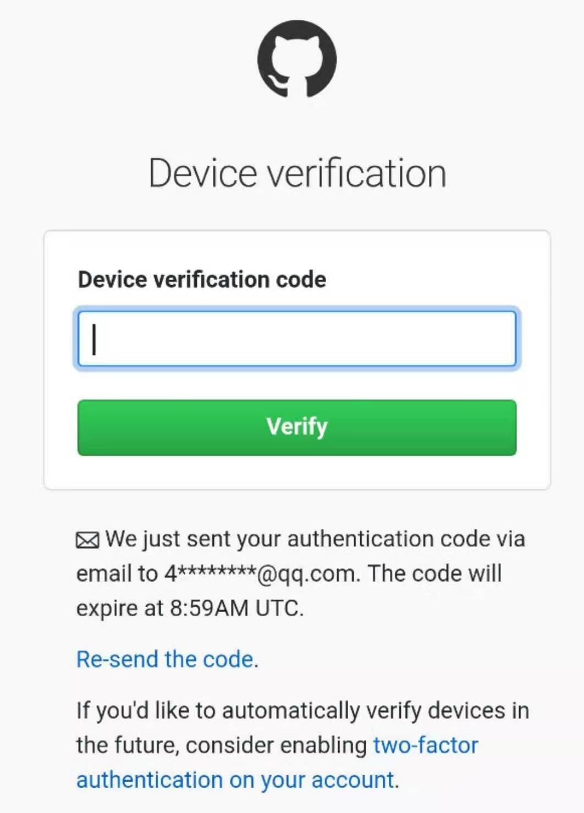
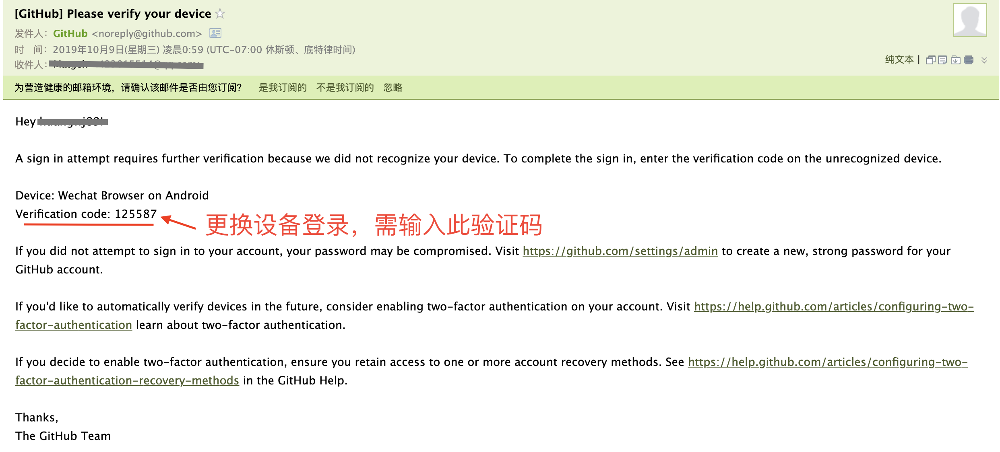

+++
title = "登录学习平台"
weight = 3
+++

1. 进入[开始学习页面](/docs/courses/)，点击任意课程的“正式学习”链接。

2. 点击“Sign in with GitHub”按钮。

3. 然后，跳转到授权登录页面，点击绿色的按钮即可。点击后，正常就能进入学习平台了。

> 点击后如果没有正常跳转，页面上显示403问题，请确认是否按照上一步[激活账号](/docs/apply-account/activate-account/)的操作正确执行了。

## 更换设备登录

当你使用一台新的设备登录时，例如你原先是在电脑上注册的GitHub账号，现在要在手机上登录。这时会出现下面这个页面提示你需要输入一个设备验证码。

GitHub已发送一封邮件到你注册时用的那个邮箱，找到邮件中的验证码，输入即可。

