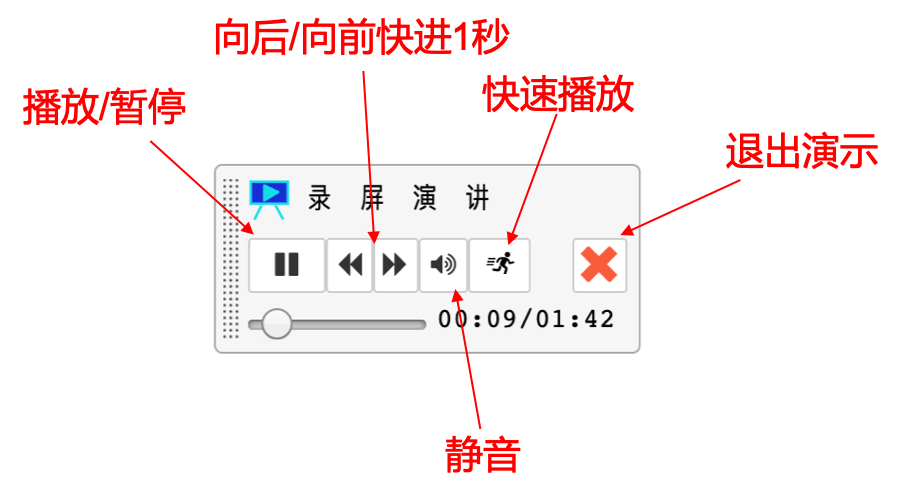

+++
title = "Jupyter Notebook编程环境"
weight = 10
+++

Jupyter Notebook是一款网上交互式编程环境。无需你在自己的电脑上安装任何软件，只需打开浏览器就能在同一个网页上，一边学习教程，一边动手编写和运行代码。

## 运行代码

鼠标选中你要运行的代码框，然后你有3种方式运行：
* 点击工具栏中“运行”（"Run"）按钮
* 键盘上按下Control键不放，再同时按下Enter键
* 键盘上按下Shift键不放，再同时按下Enter键，运行后会自动选中下一个单元格

## 判断程序是否正在运行

- 代码框左侧方括号中显示星号，即`In [*]`时，表示该程序正在运行。
- 方括号显示数字时表示程序不在运行，或者已运行结束。

## 收起或展开输出结果
- 鼠标单击输出结果左侧空白处，能设置输出结果为滚动状态或全展开状态。
- 鼠标双击输出结果左侧空白处，能完全收起输出结果。

## 插入单元格（代码框）
* 工具栏中，点击“+”键，将在当前单元格下方新插入一个单元格（默认插入代码框）。
* 或者，在命令模式下，键盘按“B”键

## 切换单元格为文本框/代码框
* 鼠标选中单元格，在工具栏中选择：

* 或者，在命令模式下，按"M"键切换为文本框，按“Y”键切换为代码框

## 切换命令模式和编辑模式
* 从命令模式进入编辑模式需按 Enter 键或者双击单元格。
* 从编辑模式切换到命令模式需按单元格左侧空白处。
* 编辑模式下单元格框线为绿色。命令模式下单元格为蓝色，这时命令模式快捷键能生效。

## 显示行号
* 在菜单栏中，点击“查看” > "切换行号"

## 文本框切换编辑模式和显示模式
* 一般情况下，文本框的内容处于显示模式，鼠标双击文本框会进入编辑模式
* 在编辑模式下，鼠标选中后，点击工具栏中的“运行”按钮，或按下Control + Enter键，会返回显示模式。

## 进入文件目录页面
* 点击页面左上角的Jupyter标记，就能进入文件目录页。

## 上传文件
* 你要上传文件到哪个文件夹，就先进入这个文件夹的目录页
* 然后，点击右上角的“上传”按钮，选择你要上传的文件并确认
* 这时，下方文件列表会显示该文件，你可以修改文件的名称，然后点击右侧上传按钮，即开始上传。

## 常见问题处理1: 程序长时间没有运行结束
* 当程序长时间处于正在运行状态中（即一直处于`In [*]`状态），可能的原因是后台的计算服务没有连接上，这时可以尝试重启服务。
* 点击菜单栏中“服务” > "重启"；
* 重启服务后，之前的程序运行状态，如变量等，将丢失。你需要重新运行程序。

## 常见问题处理2: 页面间隔很久未操作，返回再次操作时提示“连接失败”

* 后台由你独享的服务器会在你没有任何操作30分钟后关闭。
* 因此如果你打开一个网页，过了30分钟没有任何操作后，回到这个页面，此时远程服务器已关闭，会提示“连接失败”，你的任何操作也会没有反应。
* 这时你需要刷新一下页面，后台就会自动地为你启动你的服务器，并重新连接，你便可以正常使用。

## 常见问题处理3: “提示笔记改变了”

* 出现这个提示可能原因是有人在别处修改了你正在打开的这个notebook，导致notebook可能处于不一致的状态。
* 你可以选择“重载”把别处的修改也在当前的页面上读取出来，或者选择“重写”把你当前页面上的修改与别处的修改合并保存到磁盘上。
* 一般情况下，选择“重载”或“重写”都可以解决问题。

## 常见问题处理4: “不停地自动重启服务”
* 这个问题一般是由于你的服务将内存快占用满了。
* 解决方法是返回目录页面（点击左上角的Jupyter的标记） -> 点击“运行”标签页 -> 关闭一些不必要的Notebook。 
* 如果还不能解决问题，可以重启服务器： 点击右上角“Control Panel”按钮，进入新页面，先点击红色的“Stop My Server”按钮，稍等一会，服务器停止后，页面上会显示"Start My Server"按钮，点击该按钮则重新启动服务器。

# 屏幕演示和语音讲解

在教程中，划有暗绿色虚线的地方就是可以点击观看屏幕演示讲解的地方，在页面右侧也有一个标记表示这里有屏幕演示。

点击划虚线文字处，就可以打开演示。

> 注意⚠️：点击后，就会有语音开始播放哦，请根据周围环境，注意调整音量或使用耳机。

当你退出演示时，演示过程中播放的代码和输出结果会一同消失。

